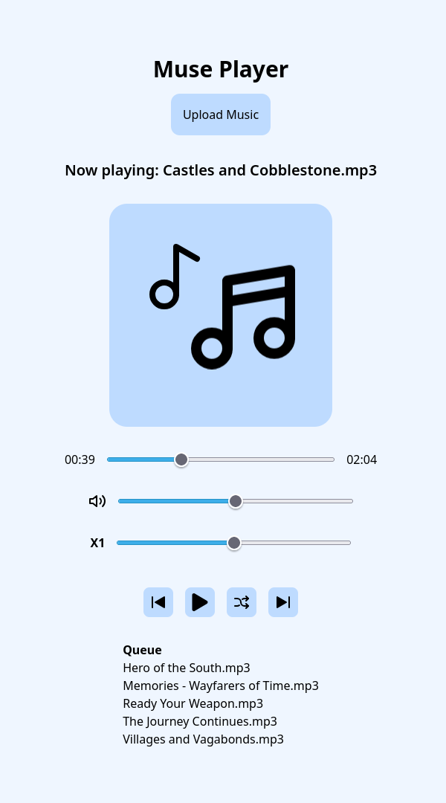

# Muse Player
Muse Player is a simple audio player written in pure HTML and JavaScript, and uses Tailwind CSS for the UI.  

This project was done as part of my Multimedia Applications unit in university, completed in under a day.

## Features
- Multiple audio file upload
- Seeking forward and backwards through loaded songs
- Playing and pausing audio
- Shuffling loaded songs
- UI presenting next song queue
- Volume controls
- Playback speed controls
- Keyboard shortcuts for seeking and changing volume

## Controls
- `Space` - used for playing/pausing
- `Left/Right` - seek 5 seconds backwards or forwards in a track
- `Up/Down` - increase/decrease volume
- `m` - mute the volume

## Screenshots
